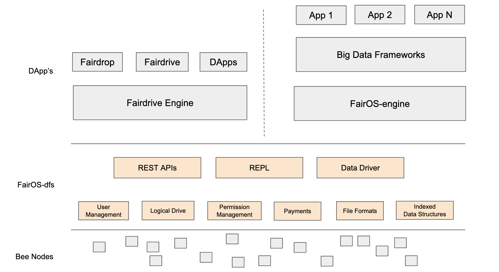

# FairOS-dfs

[](https://github.com/fairDataSociety/fairOS-dfs/actions)
[](https://pkg.go.dev/github.com/fairdatasociety/fairOS-dfs)
[](https://goreportcard.com/report/github.com/fairDataSociety/fairOS-dfs)
[](https://docs.fairos.fairdatasociety.org/api/index.html)


[](https://deepsource.io/gh/fairDataSociety/fairOS-dfs/?ref=repository-badge)

Latest documentation is available at [https://docs.fairos.fairdatasociety.org/docs/](https://docs.fairos.fairdatasociety.org/docs/)



The Decentralised File System (dfs) is a file system built for the [FairOS](https://github.com/fairDataSociety/fairOS/blob/master/README.md).
It is a stateless thin layer which uses the building blocks provided by Swarm to provide high level functionalities like
- Exposing a logical file system
- Creation of logical drives
- User and Permission management
- Charging and Payments
- Mutable, Indexed data structures over immutable file system

dfs can be used for the following use cases
1) Personal data store
2) Application data store (for both Web 3.0 DApps and web 2.0 Apps)
3) Data sharing with single user and on an organizational level

## User
The first step in dfs is to create a user. Every user is associated with a 12 
word mnemonic based hd wallet. This wallet is password protected and stored in 
the blockchain as ens record. whenever a user created a pod for himself, a new key pair 
is created using this mnemonic.

## What is a pod?
A pod is a personal drive created by a user. It is used to store files and related metadata in a decentralised fashion. A pod is always under the control of the user who created it. A user can create and store any number of files or directories in a pod. 
The user can share files in his pod with any other user just like in other centralised drives like dropbox. Not only users, a pod can be used by decentralised applications (DApp's) to store data related to that user.

Pod creation is cheap. A user can create multiple pods and use it to organise his data. for ex: Personal-Pod, Applications-Pod etc.

## (NEW) What is a group? 
A group is a shared drive created by a user. It is basically a pod, but on steroids. Group Owner can add members and update permissions. Members with "write" permission can create and store any number of files or directories in a group.

## How to run FairOS-dfs?
Run the following command to download the latest release

```
curl -o- https://raw.githubusercontent.com/fairDataSociety/fairOS-dfs/master/download.sh | bash
```
```
wget -qO- https://raw.githubusercontent.com/fairDataSociety/fairOS-dfs/master/download.sh | bash
```

Or download the latest release from https://github.com/fairDataSociety/fairOS-dfs/releases.

Or use Docker to run the project https://docs.fairos.fairdatasociety.org/docs/fairOS-dfs/fairos-dfs-using-docker.

Or build the latest version with the instruction https://docs.fairos.fairdatasociety.org/docs/fairOS-dfs/manual-installation.

## Configure FairOS-dfs
To get the most out of your FairOS-dfs it is important that you configure FairOS-dfs for your specific use case!

##### Configuration for Bee
```
bee:
  bee-api-endpoint: http://localhost:1633
  postage-batch-id: ""
```

##### Configuration for FairOS-dfs
```
dfs:
  ports:
    http-port: :9090
    pprof-port: :9091
```

### ENS based Registration

##### RPC endpoint
Fairos depends on blockchain RPC to authenticate user accounts. Hence, it needs `rpc` to connect to
```
rpc: http://localhost:9545
```

##### Custom configuration for ENS based Registration
For ENS based authentication we can either use a `ens-network` configuration in the config file 
```
// define network for ens authtication
ens-network: "testnet"
```

#### Other configuration
```
cookie-domain: api.fairos.io
cors-allowed-origins: []
verbosity: trace
```

This is how a config file should look like
``` .dfs.yaml
bee:
  bee-api-endpoint: http://localhost:1633
  postage-batch-id: <BATCH>
cookie-domain: localhost
cors-allowed-origins: []
dfs:
  ports:
    http-port: :9090
    pprof-port: :9091
rpc: http://localhost:9545
network: "testnet"
verbosity: trace
```

Run `dfs config` to see all configurations

### Help for dfs
```
$ dfs server -h                                                                                                                            

  /$$$$$$          /$$            /$$$$$$   /$$$$$$                /$$  /$$$$$$         
 /$$__  $$        |__/           /$$__  $$ /$$__  $$              | $$ /$$__  $$        
| $$  \__//$$$$$$  /$$  /$$$$$$ | $$  \ $$| $$  \__/          /$$$$$$$| $$  \__//$$$$$$$
| $$$$   |____  $$| $$ /$$__  $$| $$  | $$|  $$$$$$  /$$$$$$ /$$__  $$| $$$$   /$$_____/
| $$_/    /$$$$$$$| $$| $$  \__/| $$  | $$ \____  $$|______/| $$  | $$| $$_/  |  $$$$$$ 
| $$     /$$__  $$| $$| $$      | $$  | $$ /$$  \ $$        | $$  | $$| $$     \____  $$
| $$    |  $$$$$$$| $$| $$      |  $$$$$$/|  $$$$$$/        |  $$$$$$$| $$     /$$$$$$$/
|__/     \_______/|__/|__/       \______/  \______/          \_______/|__/    |_______/


Serves all the dfs commands through an HTTP server so that the upper layers
can consume it.

Usage:
  dfs server [flags]

Flags:
      --cookieDomain string     the domain to use in the cookie (default "api.fairos.io")
      --cors-origins strings    allow CORS headers for the given origins
  -h, --help                    help for server
      --httpPort string         http port (default ":9090")
      --network string          network to use for authentication (mainnet/testnet/play)
      --postageBlockId string   the postage block used to store the data in bee
      --pprofPort string        pprof port (default ":9091")
      --rpc string              rpc endpoint for ens network. xDai for mainnet | Sepolia for testnet | local fdp-play rpc endpoint for play
      --swag                    should run swagger-ui
Global Flags:
      --beeApi string      full bee api endpoint (default "localhost:1633")
      --config string      config file (default "/Users/sabyasachipatra/.dfs.yaml")
      --verbosity string   verbosity level (default "trace")
```

### HTTP APIs

https://docs.fairos.fairdatasociety.org/docs/fairOS-dfs/api-reference

### REPL Commands in dfs-cli

https://docs.fairos.fairdatasociety.org/docs/fairOS-dfs/cli-reference

### Make binaries for all platforms

To make binaries for all platforms run this command

`./generate-exe.sh`

### Generate swagger docs

#### Install swag

```
go install github.com/swaggo/swag/cmd/swag@latest
```

#### Generate

```
make swagger
```

### Running swagger-ui

By default, swagger-ui is disabled. To run swagger-ui we run the `server` command with `--swag` flag

```
$ dfs server --swag
```

This should run the dfs server along with swagger-ui, available at `http://localhost:9090/swagger/index.html` assuming 
server is running on default `9090` port on your localhost

### Running fairOS on sepolia testnet and swarm mainnet

we need to set `network` configuration in the config file as testnet and bee configuration should point to a bee running
on mainnet 

```
network: "testnet"
bee:
  bee-api-endpoint: http://localhost:1633 # bee running on mainnet  
  postage-batch-id: <BATCH>
```